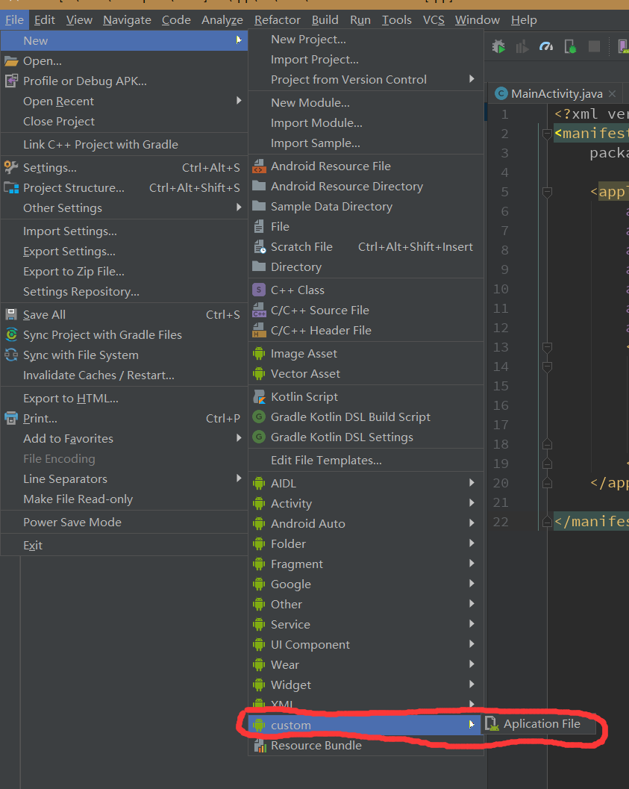

# AndroidStudioTemplate

Custom Android Studio templates/自定义 Android Studio 模板

这是一个方便开发的 Android Stuido 模板库。
> 模板的使用方法是将文件夹复制到 `{androidStudio-folder}/plugins/android/lib/templates/`路径下，模板就会在如图位置出现：

## 内容

### Application File

一个继承 Application 的自定义 Application 类，创建时可以修改名称。其中已实现通过监听 Activity 生命周期对 Activity 进行管理的方法。

## Credits
作者：gn_139  
邮箱：gn_139@outlook.com \
qq：1934264186

## License

    Copyright 2018 GuangLe Huang

    Licensed under the Apache License, Version 2.0 (the "License");
    you may not use this file except in compliance with the License.
    You may obtain a copy of the License at

    http://www.apache.org/licenses/LICENSE-2.0

    Unless required by applicable law or agreed to in writing, software
    distributed under the License is distributed on an "AS IS" BASIS,
    WITHOUT WARRANTIES OR CONDITIONS OF ANY KIND, either express or implied.
    See the License for the specific language governing permissions and
    limitations under the License.